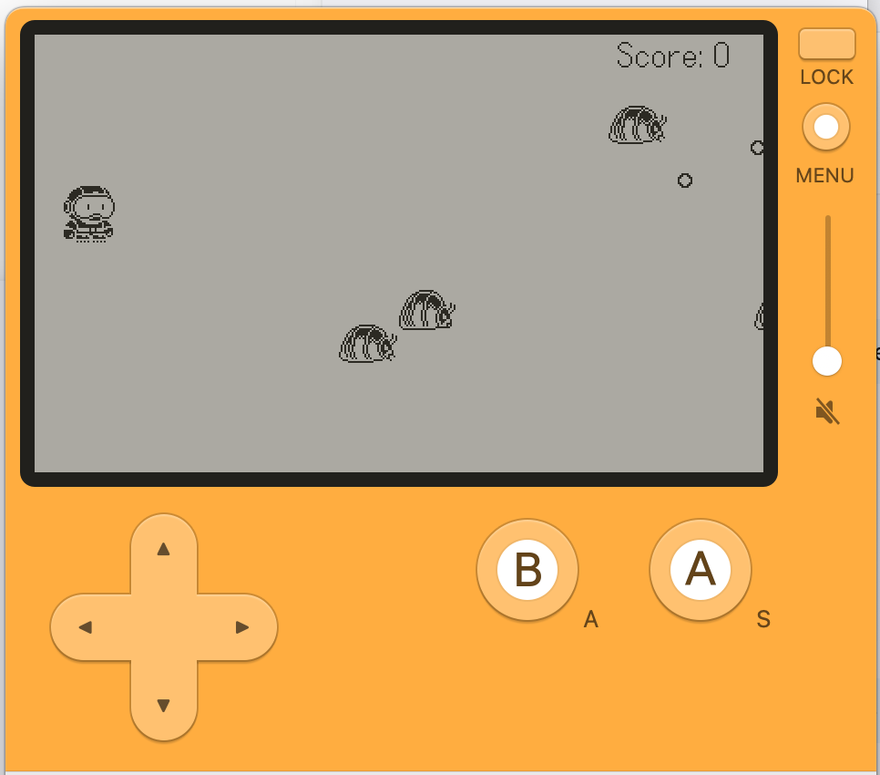

# SimpleInvaders



A simple Space Invaders-style game built to explore game development on the [Playdate](https://play.date) handheld console.

## About

This project was built as a learning exercise for game development on the Playdate using Lua and the Playdate SDK. It features a player ship, enemy spawning, bullet mechanics, score tracking, and screen shake effects.

## Features

- Player movement and shooting
- Enemy spawning system with multiple enemy types (slug, spider)
- Animated sprites
- Score display
- Screen shake on impact

## Requirements

- [Playdate SDK](https://play.date/dev/)
- Playdate Simulator or a Playdate device

## Building

Open the project in VS Code with the Playdate extension and run the **Playdate: Build and Run** task, or use the Playdate SDK CLI:

```sh
pdc source SimpleInvaders.pdx
```

## License

Personal project — not licensed for redistribution.
